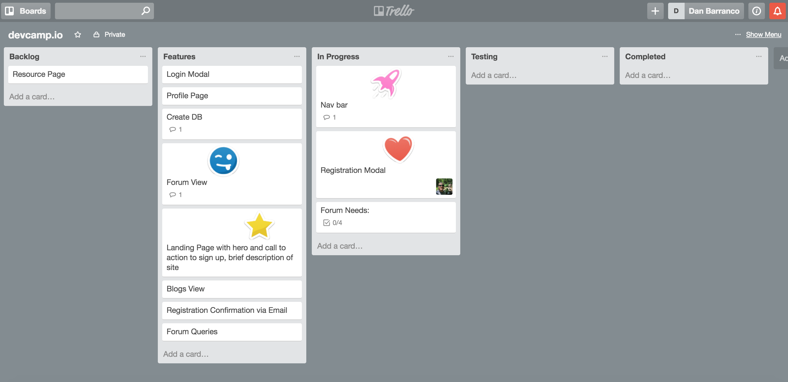
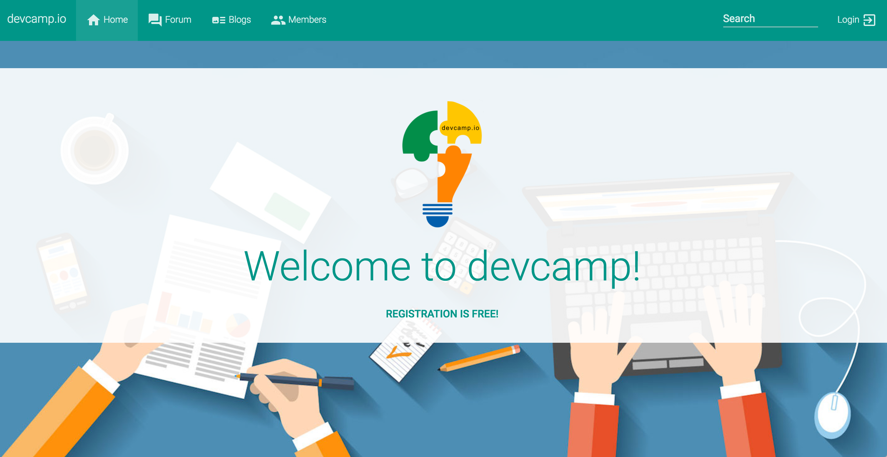
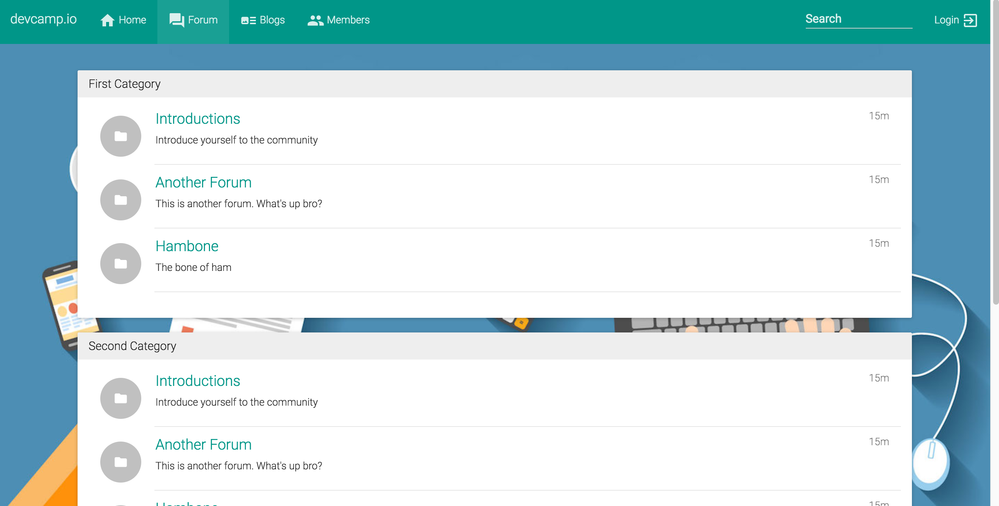
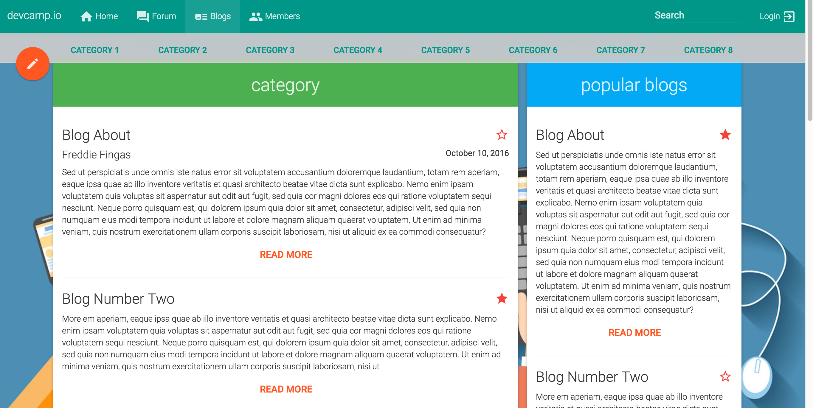
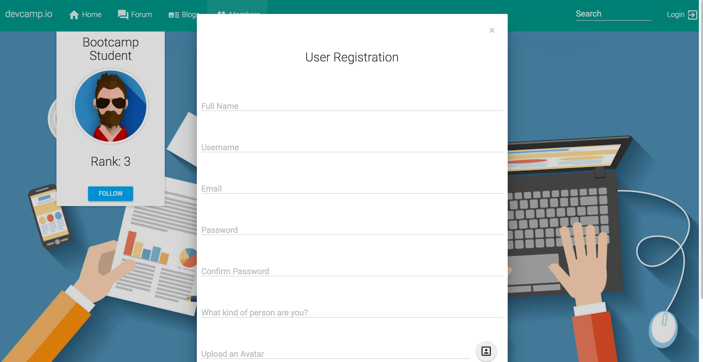

#Devcamp.io - An interactive playground for bootcamp students: past, present, and future!

###Contributors
Danny Arango [Github](https://www.github.com/thenew000) [Website](https://www.dannyarango.com)
Daniel Barranco [Github](https://www.github.com/carrottop17) [Website](https://www.danielbarranco.com)
Brett Burdick [Github](https://www.github.com/BRETT-B) [Website](https://www.brettburdick.com)
Jackson Yeager [Github](https://www.github.com/volitiondevelopment) [Website](https://www.volition-dev.com)
=======

#Devcamp.io - An interactive playground for bootcamp students: past, present, and future
* A back-end project for DigitalCrafts that must utiilze a server side languange
* Utilize scrum agile methodology implemented via scrum meetings and scrum board to track our progress

#Overview
* Devcamp.io is site where coding bootcamp students, potential students, and graduates can come to post blogs about their experiences and discuss topics in the forum
* Users can register for an account
* Users can upload an avatar for their account
* Users can post blogs, follow other members and favorite blogs
* Users can post threads and reply to threads in the forum

#Technologies, Frameworks, and Programming Languages used

##### Languages:
HTML5, CSS3, JavaScript, Python

##### Frameworks:
Bootstrap, Angularjs, Flask, SASS

#### Relational Database:
MySQL

#Project Screenshots

>>>>>>> 173c63b4037bf1c9e5a2638ec919ca96e656b651

###Contributors:
Danny Arango [Github](https://github.com/TheNew000) [Website](www.dannyarango.com)

Daniel Barranco [Github](https://github.com/carrottop17) [Website](www.danielbarranco.com)

Brett Burdick [Github](https://github.com/BRETT-B) [Website](www.brettburdick.com)

Jackson Yeager [Github](https://github.com/VolitionDevelopment) [Website](www.volition-dev.com)
